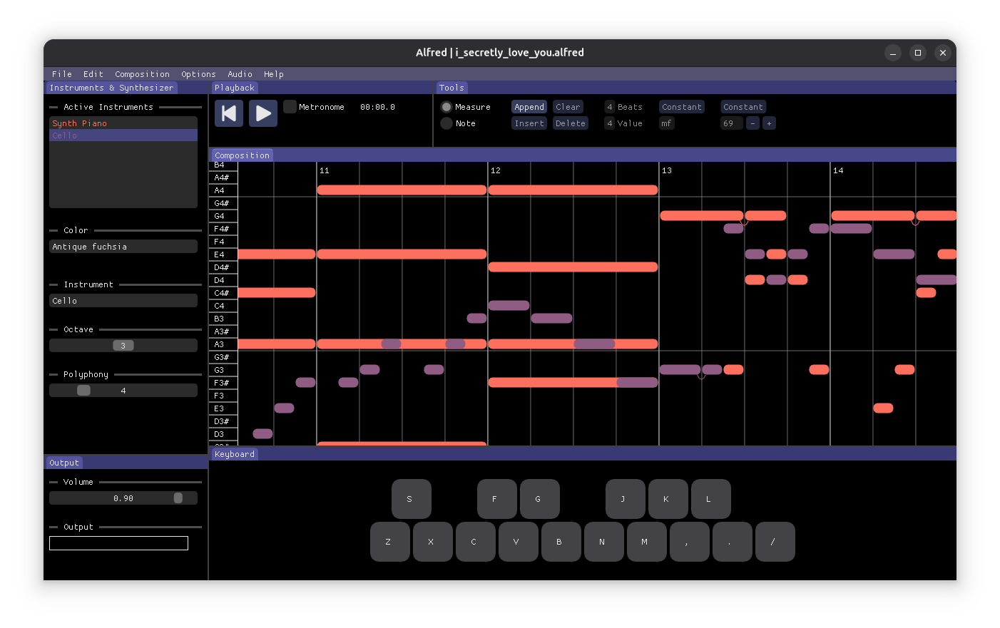

# Alfred Manual

With Alfred one can play the synthesizer using the small virtual keyboard, and can create, edit, save, open and render compositions.

Compositions are made of a set of measures, each having a specific time signature, dynamics, agogic and a set of notes.

The notes, of course, have a value, a pitch, loudness and a timbre (an instrument/preset). Loudness is controlled by the measure. But they also have a delay value usually used to implement arpeggios, and they can be tied to following notes through legatos. Legatos are used to implement notes with a value and a half (dotted notes) and notes spanning two measures.

Compositions have some metadata properties, namely `Title`, `Author` and `Year`. `Composition -> Metadata`

Compositions also have a mixer with the active instruments, that can be used to adjust the volumes in decibels. `Composition -> Mixer`

Alfred logs information, warnings and errors in a log file, that one can access from their user home directory. `Help -> Log File`

Compositions can be rendered to uncompressed WAV files. One can choose to normalize the output automatically or not. `File -> Render`

Compositions can be saved and opened from disk from the `File` menu. `Open Recent` displays recently saved and opened compositions.

## Composition

It is the main work area where measures and notes and placed, inserted, removed, edited etc.

Camera is moved by dragging the mouse with `Right Click` or by scrolling the wheel. Hold `Shift` while scrolling to change the axis.

Measures and notes are selected/deselected and new notes are placed with `Left Click`. 

The player cursor can be moved by holding `Alt` and pressing `Left Click`.

## Instruments & Synthesizer

`Active Instruments` list displays the instruments/presets that are currently used in the composition.

`Color` selector changes the color of the currently selected instrument/preset.

`Instrument` selector changes the current instrument/preset from the full list of available instruments/presets.

`Octave` slider changes the octave of the test synthesizer.

`Loudness` slider changes the loudness level of the test synthesizer.

`Polyphony` slider changes the maximum number of voices of the test synthesizer.

## Playback

There are two buttons for starting, stopping and rewinding the player to the beginning.

There is one checkbox for enabling/disabling the metronome while the player is running.

The elapsed time in seconds is displayed to the right. If the elapsed time is colored in red/orange, then the application is not running fast enough to handle the play speed.

## Tools

### Measure

`Append` button adds a few measures to the end of the composition.

`Insert` button adds a measure after the currently selected measure.

`Clear` button deletes all the notes from the currently selected measure.

`Delete` button deletes the currently selected measure.

`Beats` and `Value` selectors display and change the currently selected measure's time signature

To the right there are two interfaces to display and change the dynamics and agogic of the currently selected measure. `Constant` values apply to the whole measure, while `Varying` values change linearly from the beginning of the measure to the end.

### Note

The four `Up`, `Down`, `Left`, `Right` buttons to the left move the currently selected notes.

`Delete` button deletes the currently selected notes.

`Legato` button toggles the legato for the currently selected notes.

The two `Left` and `Right` buttons change the delay of the currently selected notes.

The `Whole`, `Half`, `Quarter`, `Eighth` and `Sixteenth` radio buttons changes the value of newly placed notes.

`None` and `Triplet` radio buttons changes the tuplet mode of newly placed notes.

## Output

`Volume` slider changes the master volume of the application in a linear scale.

`Output` displays the current sample output in amplitude from 0 to 1.

## Keyboard

Displays the virtual keyboard.

## Advanced Features

One can adjust the audio device sample frames by running the application with the options `--low-latency` or `--high-latency`:

- Default, no option: 512
- `--low-latency`: 256
- `--high-latency`: 1024
